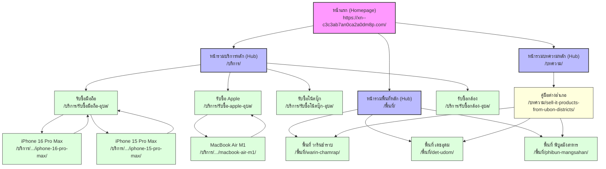

# ผังโครงสร้างลิงก์ภายใน (Internal Link Map) — รับซื้ออุบล.com

โครงสร้างสถาปัตยกรรมข้อมูล (Information Architecture) และเครือข่ายลิงก์ภายใน (Internal Linking Network) ของเว็บไซต์รับซื้ออุบล.com ได้รับการออกแบบตามแนวทาง **Hub-and-Spoke SEO Model** เพื่อกระจายคะแนนความน่าเชื่อถือ (PageRank / Link Equity) และช่วยให้บอทของเสิร์ชเอนจิน (Googlebot) สามารถคลานเก็บข้อมูลและจัดทำดัชนีได้อย่างทั่วถึง

---

## 1. แผนภาพโครงสร้างเครือข่าย (Mermaid Architecture Diagram)

---

## 2. กฎการเชื่อมโยงลิงก์ภายใน (Internal Link Rules)

### กฎที่ 1: การเชื่อมโยงจากบนลงล่าง (Top-Down Linking)
- **หน้าแรก** จะต้องลิงก์ไปยัง **หน้าหลักบริการ (Hub)**, **หน้ารวมพื้นที่** และ **หน้ารวมบทความ** เสมอ
- หน้าแรกมีเมนูลิงก์แบบ Dropdown ลิงก์ตรงเข้าสู่หน้าหมวดหมู่ย่อย (เช่น โทรศัพท์, โน้ตบุ๊ก, Apple)
- หน้ารายการอำเภอ 10 อำเภอหลักที่ให้บริการรับซื้อด่วน จะถูกแสดงเป็นกล่องตัวเลือกบนหน้าแรก เพื่อให้ผู้ใช้และบอทเข้าถึงพื้นที่หลักได้ทันทีจาก Root Page

### กฎที่ 2: ลิงก์ขากลับขึ้นด้านบน (Bottom-Up to Hubs)
- หน้ารุ่นย่อย (Model Spokes เช่น `iphone-16-pro-max`) จะต้องมีลิงก์นำทางย้อนกลับขึ้นด้านบน (Breadcrumbs) ไปยังหน้าหมวดหมู่หลัก (เช่น `รับซื้อ-iphone-อุบล`) และหน้าแรกเสมอ
- หน้าย่อยบริการพื้นที่บริการรายอำเภอ (เช่น `/พื้นที่/warin-chamrap/`) มี Breadcrumbs ย้อนกลับไปหน้าแรก เพื่อเพิ่มการระบุความเกี่ยวเนื่องทางโครงสร้างและเส้นทางของผู้ใช้

### กฎที่ 3: การเชื่อมโยงข้ามสาย (Cross-Linking / Peer-to-Peer)
- หน้าสินค้าแบรนด์ (เช่น `รับซื้อ-samsung-อุบล`) ลิงก์เชื่อมโยงข้ามไปยังหน้าบริการคอมมอนเวิลด์ (เช่น `รับซื้อมือถือ Android`) เพื่อช่วยแก้ปัญหาผู้ค้นหาที่สับสนเรื่องกลุ่มสินค้า
- หน้าย่อยของสินค้าชำรุด (เช่น `รับซื้อโน้ตบุ๊กเปิดไม่ติด`) มีการเชื่อมลิงก์ย้อนกลับไปหน้าบริการโน้ตบุ๊กหลัก เพื่อช่วยรักษาคนเข้าชมให้อยู่บนหน้าเว็บต่อหากเครื่องยังสามารถประเมินเป็นเครื่องสภาพดีได้

### กฎที่ 4: ลิงก์บริบทจากบทความ (Contextual Blog Links)
- บทความแนะนำข้อมูลเชิงวิชาการ/เชิงลึก (เช่น `sell-it-products-from-ubon-districts`) จะต้องระบุแท็กลิงก์บริบทไปยังหน้ารับบริการระดับสินค้าหลัก (เช่น `/บริการ/รับซื้อมือถือ-อุบล/`) และลิงก์ไปยังหน้าระดับอำเภอปลายทางในกรณีที่บทความมีการกล่าวอ้างถึงพื้นที่ เพื่อส่งสัญญาณความสมบูรณ์ของความคุ้มครองเนื้อหาไปยังเซิร์ชเอนจิน
