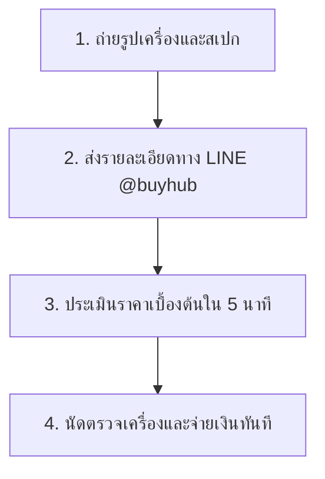

## บริการรับซื้อคอมพิวเตอร์มือสองในอุบลราชธานี สะดวก รวดเร็ว มีหน้าร้านจริง

สำหรับลูกค้าที่ต้องการเปลี่ยนคอมพิวเตอร์ตั้งโต๊ะเครื่องเก่า คอมประกอบ หรือคอมพิวเตอร์สำนักงานที่ไม่ได้ใช้งานแล้วให้เป็นเงินสด **รับซื้ออุบล.com** ยินดีให้บริการรับซื้อและรับเทิร์นคอมพิวเตอร์ในพื้นที่จังหวัดอุบลราชธานีและพื้นที่ใกล้เคียง เรามุ่งเน้นการประเมินราคาที่เป็นธรรม อ้างอิงตามสเปก สภาพการใช้งานจริง และกลไกตลาด ณ ช่วงเวลานั้นๆ ไม่มีค่าใช้จ่ายแอบแฝง

เราเข้าใจดีว่าคอมพิวเตอร์แต่ละเครื่องมีรายละเอียดที่ต่างกัน ไม่ว่าจะเป็นคอมพิวเตอร์แบรนด์เนมสำเร็จรูป หรือคอมประกอบที่เลือกชิ้นส่วนเอง ทีมงานของเรามีความเชี่ยวชาญในการตรวจสอบสเปกอุปกรณ์ไอทีทุกชนิด ทำให้สามารถประเมินราคาได้อย่างแม่นยำและรวดเร็ว

> [!IMPORTANT]
> 📥 **ส่งรูปสเปกคอมพิวเตอร์เพื่อประเมินราคาเบื้องต้นได้ฟรี**
> **[👉 แอด LINE @buyhub เพื่อส่งรูปและคุยรายละเอียด](https://line.me/R/ti/p/@buyhub)**

---

## ปัจจัยที่มีผลต่อการประเมินราคาคอมพิวเตอร์

ในการประเมินราคารับซื้อคอมพิวเตอร์ตั้งโต๊ะและคอมประกอบ ทีมงานจะพิจารณาจากปัจจัยหลักดังต่อไปนี้:

1. **สเปกภายในตัวเครื่อง (Hardware Specification)**
   - **หน่วยประมวลผล (CPU)**: รุ่นและเจนเนอเรชั่น (เช่น Intel Core i5 Gen 12, AMD Ryzen 5 5000 Series ขึ้นไป จะได้ราคาประเมินที่ดีตามตลาด)
   - **หน่วยความจำ (RAM)**: ความจุประเภท DDR4 หรือ DDR5 (ขนาด 16GB หรือมากกว่า)
   - **การ์ดจอ (VGA/GPU)**: ออนบอร์ดหรือการ์ดจอแยก (การ์ดจอแยกซีรีส์ยอดนิยมจะได้ราคาเพิ่มขึ้น)
   - **อุปกรณ์จัดเก็บข้อมูล**: SSD M.2 NVMe หรือ SSD SATA ที่มีสุขภาพการใช้งานดี
2. **สภาพตัวเครื่องและอุปกรณ์ภายนอก**
   - เคสคอมพิวเตอร์ไม่มีรอยแตก บุบ หรือมีตำหนิรุนแรง
   - พอร์ตเชื่อมต่อต่างๆ (USB, HDMI, DisplayPort) สามารถใช้งานได้ตามปกติ
   - พัดลมระบายความร้อนทำงานเงียบและไม่มีเสียงดังผิดปกติ
3. **การรับประกัน (Warranty)**
   - หากชิ้นส่วนหรือตัวเครื่องยังมีประกันศูนย์ในไทยเหลืออยู่ (เช่น JIB, Advice, Synnex) จะช่วยเพิ่มราคาประเมินให้สูงขึ้นได้
4. **อุปกรณ์เสริมอื่นๆ**
   - หากมีกล่องของอุปกรณ์ชิ้นส่วนต่างๆ ครบถ้วน รวมถึงสายไฟ สายเชื่อมต่อต่างๆ จะช่วยให้ประเมินราคาได้สะดวกขึ้น

---

## ขั้นตอนง่ายๆ ในการขายคอมพิวเตอร์กับเรา

เพื่อความสะดวกและรวดเร็ว ลูกค้าในพื้นที่อุบลราชธานีสามารถดำเนินการตามขั้นตอนดังนี้ได้ทันที:

1. **ถ่ายรูปตัวเครื่องและหน้าจอแสดงสเปก**
   - ถ่ายภาพตัวเคสคอมพิวเตอร์โดยรอบ
   - ถ่ายหน้าจอสเปกจากระบบปฏิบัติการ (คลิกขวาที่ This PC ➔ Properties หรือผ่านโปรแกรม CPU-Z)
2. **ส่งข้อมูลเพื่อประเมินราคา**
   - ส่งรูปถ่ายและรายละเอียดสเปกมาทาง LINE **@buyhub**
3. **รับราคาประเมินเบื้องต้น**
   - ทีมงานจะแจ้งราคาประเมินเบื้องต้นให้ทราบอย่างรวดเร็ว เพื่อให้คุณพิจารณาก่อนตัดสินใจ
4. **นัดหมายตรวจเช็กเครื่องจริง**
   - เมื่อตกลงราคาเรียบร้อยแล้ว สามารถนัดตรวจเช็กเครื่องจริงในเขตอำเภอเมืองอุบลราชธานี วารินชำราบ หรือพื้นที่ใกล้เคียง เมื่อตรวจเช็กเรียบร้อยจะทำการจ่ายเงินสดหรือโอนเงินให้ทันที

---

## พื้นที่ให้บริการรับซื้อคอมพิวเตอร์ในอุบลราชธานี

เรามีบริการนัดรับสินค้าและตรวจเช็กเครื่องครอบคลุมพื้นที่หลายอำเภอในจังหวัดอุบลราชธานี เพื่อให้ลูกค้าได้รับความสะดวกสบายสูงสุด ไม่ต้องเดินทางไกล:

- อำเภอเมืองอุบลราชธานี
- อำเภอวารินชำราบ
- อำเภอเดชอุดม
- อำเภอพิบูลมังสาหาร
- อำเภอตระการพืชผล
- อำเภอม่วงสามสิบ
- อำเภอเขื่องใน
- อำเภอโขงเจียม
- อำเภอน้ำยืน
- อำเภอบุณฑริก

หากลูกค้าอยู่นอกพื้นที่บริการดังกล่าว หรือมีสินค้าจำนวนมาก (เช่น คอมพิวเตอร์บริษัทหรือสำนักงาน) สามารถแจ้งข้อมูลกับทีมงานทาง LINE เพื่อตกลงเงื่อนไขการเดินทางไปรับซื้อเป็นกรณีพิเศษได้ครับ

## หน้าบริการที่เกี่ยวข้อง

- [รับซื้อคอมพิวเตอร์ พิบูลมังสาหาร](/บริการ/รับซื้อคอมพิวเตอร์-พิบูลมังสาหาร/)
- [รับซื้อคอมประกอบ อุบล](/บริการ/รับซื้อคอมประกอบ-อุบล/)
- [รับซื้อ CPU อุบล](/บริการ/รับซื้อ-cpu-อุบล/)
- [รับซื้อ RAM SSD อุบล](/บริการ/รับซื้อ-ram-ssd-อุบล/)
- [รับซื้อ PC Gaming อุบล](/บริการ/รับซื้อ-pc-gaming-อุบล/)
- [รับซื้อการ์ดจอ อุบล](/บริการ/รับซื้อการ์ดจอ-อุบล/)
- [รับซื้ออะไหล่คอม อุบล](/บริการ/รับซื้อ-อะไหล่คอม-อุบล/)
